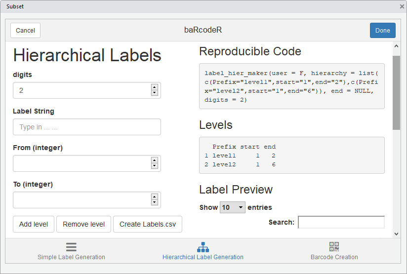
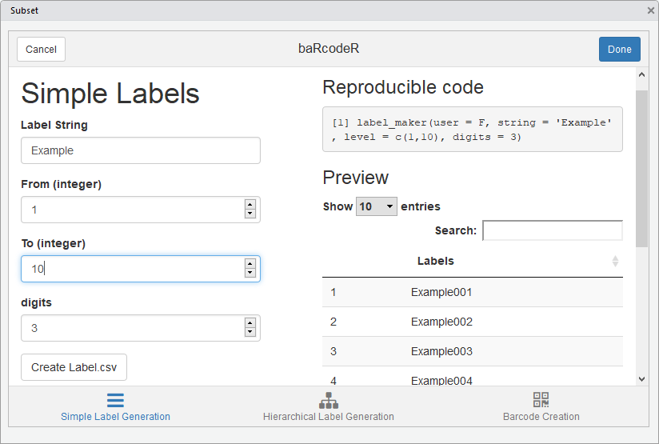

# baRcodeR

Yihan Wu, Emily Bao and Robert I. Colautti

## Quick Start:

```
devtools::install_github("yihanwu/baRcodeR")
library(baRcodeR)
```

## Introduction

`baRcodeR` is a R package for generating sample labels and 2D barcodes for labelling and tracking biological samples. Users can: 

* generate simple labels (Ex-001, Ex-002, Ex-003 ...),
* generate hierarchical labels (A-01-B-01, A-01-B-02, A-02-B-01, A-02-B-02, A-03-B01 ...),
* produce PDF files with custom layouts for all types of sticker labels.


## Usage for RStudio addin 

The main baRcodeR functions, label creation and barcode generation, can be performed interactive via the RStudio addin found on the toolbar. 


Click on the add-in, and a popup window will appear.


You can switch from the simple label generation tab to the hierarchical label generation or barcode creation tabs at the bottom.



As you fill in the fields, a preview of the labels will appear on the side.




