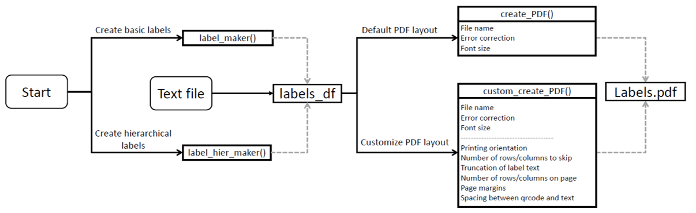
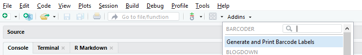
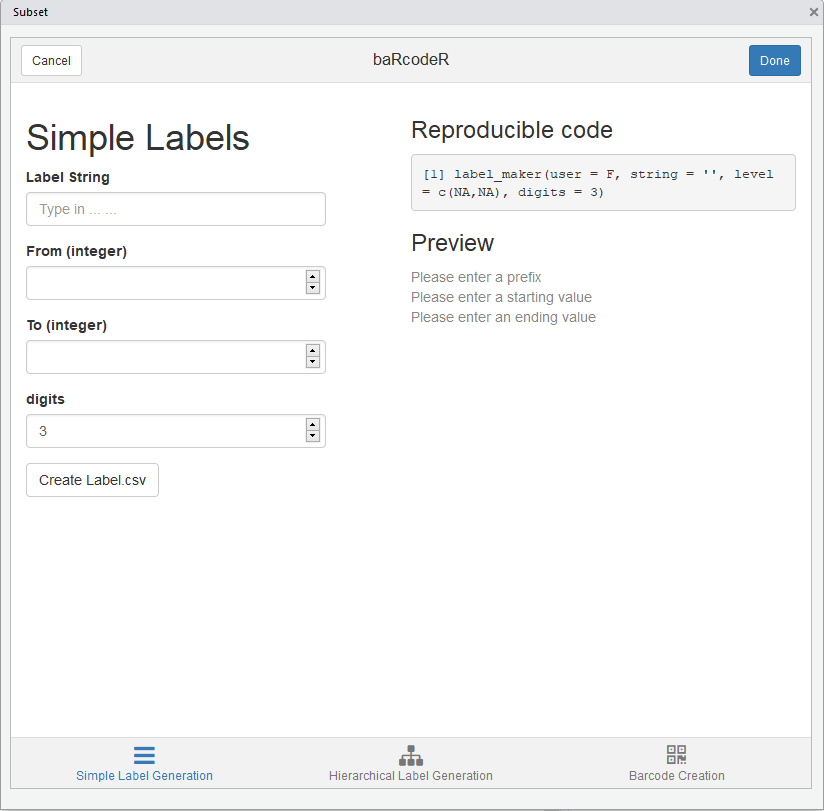
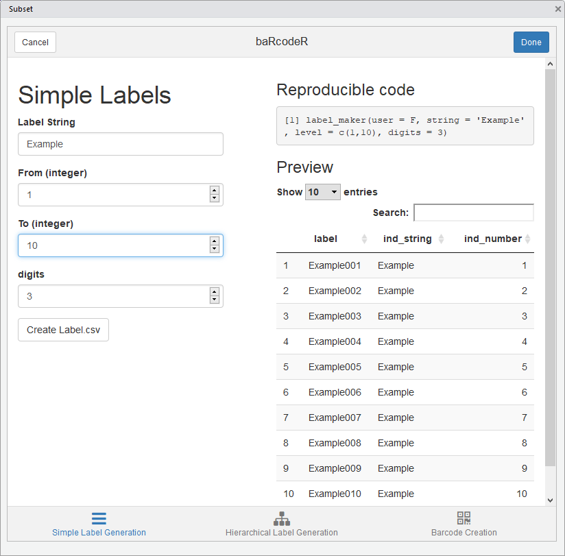
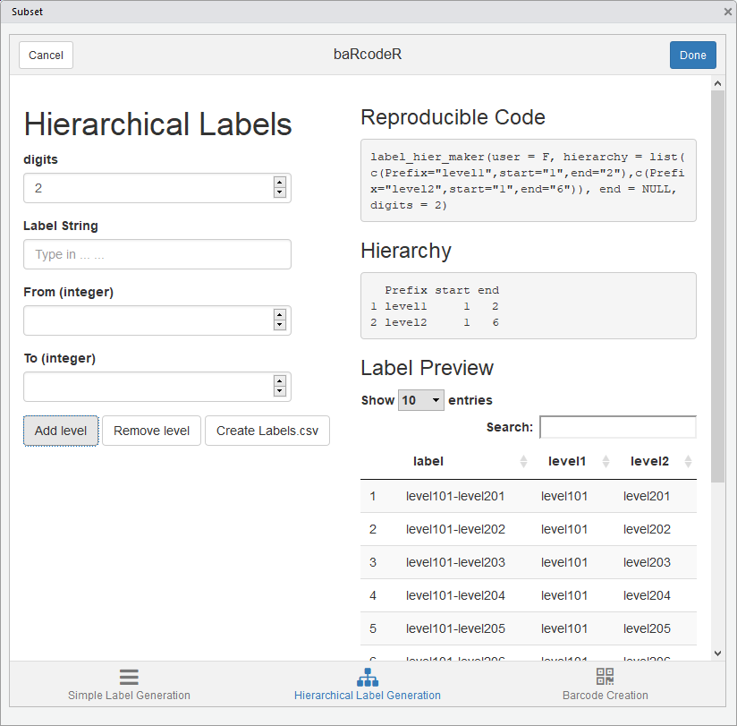
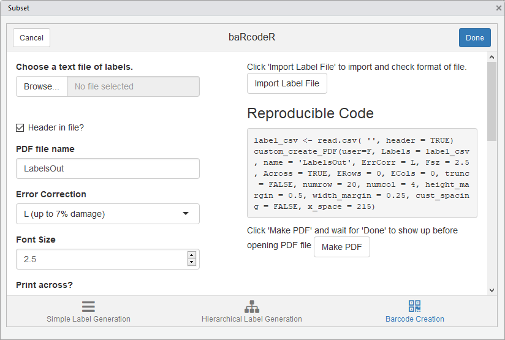
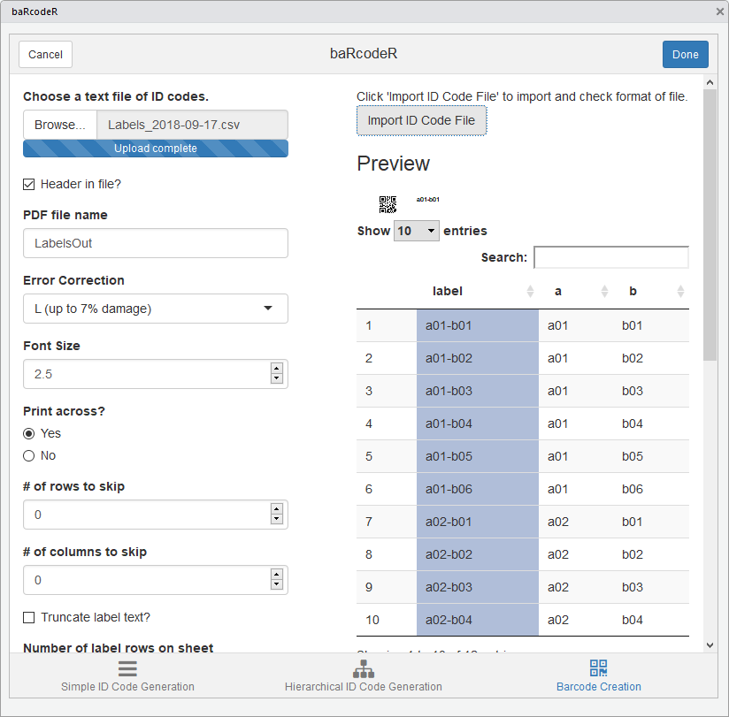

# baRcodeR
[](https://cran.r-project.org/web/packages/baRcodeR/index.html)
[](https://cran.r-project.org/web/packages/baRcodeR/index.html)

## Open-source label generation for more repeatable workflows with biological samples

Yihan Wu and Robert I. Colautti

## Cheat Sheet

A 2-page, quick-reference guide is available via [Figshare](https://dx.doi.org/10.6084/m9.figshare.7043309)

## Overview



## Quick Start:

EITHER install directly from CRAN
```
install.packages("baRcodeR")
library(baRcodeR)
```

OR install the pre-release of the latest version:

```
devtools::install_github("yihanwu/baRcodeR", build_vignettes = T)
library(baRcodeR)
```

## Introduction

`baRcodeR` is a R package for generating unique indentifier strings and printable 2D (QR) barcodes, with the aim of improving repeatability of labelling, tracking and curating data from biological samples. Specifically, users can:

* generate simple ID codes (Ex001, Ex002, Ex003 ...),
* generate hierarchical (i.e. nested) ID codes (A01-B01, A01-B02, A02-B01, A02-B02, A03-B01 ...),
* generate printable PDF files of paired ID codes and QR barcodes with default spacing for ULINE 1.75" * 0.5" WEATHER RESISTANT LABEL for laser printer; item # S-19297 (uline.ca)
* customize the PDF layout for any type of printable format (e.g, vinyl stickers, waterproof paper)
* generate reproducible code for archival purposes (e.g. in publications or online repositories)
* create CSV files to link unique IDs and sampling hierarchy with downstream data collection workflows. For example, the PyTrackDat pipeline can be used to set up a web-based data collection platform: https://github.com/ColauttiLab/PyTrackDat/

## Using the RStudio addin 

The main baRcodeR functions for unique identifiers and QR code generation can be performed interactive via the RStudio addin found on the toolbar. 



Click on the add-in, and a popup window will appear. NOTE the 3 tabs along the bottom, corresponding to the three main baRcodeR commands: `uniqID_maker`, `uniqID_hier_maker` and `create_PDF`.



The first tab generates basic ID codes:



As you fill in the fields, a preview of the ID codes will appear on the right-hand side along with reproducible code, which can be copied for archival purposes. Clicking 'Create Label.csv' will create a CSV file called 'Label_YYYY-MM-DD.csv', which contains a data frame with the full unique ID strings as the first column, the user-defined prefix string in the second column, and the unique ID number in the third column. This file is useful for archiving ID codes and as a starting point for data entry. For example, it can be opened in a spreadsheet program to add data measurement columns. It is also the input for creating printable, QR-coded labels with `create_PDF`.



You can switch from the simple ID code generation tab to the hierarchical ID code generation or QR code creation tabs at the bottom.

Hierarchical ID codes have a nested structure (e.g. X subsamples from Y individuals at Z time points), the information for each level is saved under the "Hierarchy" section. The "Add level" button is used to add more levels to the hierarchy, and the "Remove level" button will remove the most recently added level. The data frame output will contain ID codes in the first column, and a separate column for each level of the hierarchy, with the user-defined string as the header; as shown under 'Preview'. As with the simple ID code tab, the output of Hierarchical ID codes is a CSV file "Labels_YYYY-MM-DD.csv", saved in the working directory. This file is useful for archiving ID codes and as a starting point for data entry. For example, it can be opened in a spreadsheet program to add data measurement columns. It is also the input for creating printable, QR-coded labels with `create_PDF`.



The Barcode Creation tab contains all the advanced options for page layout. The default options fit a specific format: ULINE 1.75" * 0.5" WEATHER RESISTANT LABEL for laser printer; item # S-19297 (uline.ca). A text file containing ID codes is imported by clicking the "Browse" button and selecting the CSV text file in the file browser. The file is be previewed by clicking "Import File". 



After importing a CSV file, the preview shows part of the expected output PDF file based on font size and other layout options. The first column is highlighted by default and defines the column to use for the labels. Clicking on a different column will set it as the ID code column, as shown in the preview.  

Clicking "Make PDF" will generate a printable PDF of all barcodes provided. This can take several minutes for >100 barcodes, depending on computer speed. The text "Done" will appear upon completion of the PDF file.

> NOTE: When printing from pdf, ensure that 'anti-aliasing' or 'smoothing' options are turned OFF, and that you are not using 'fit to page' or similar options that will re-scale the output.

## Usage from the console

Please load the vignette "Using-baRcodeR" for console use.

```
library(baRcodeR)
vignette("Using-baRcodeR")
```

